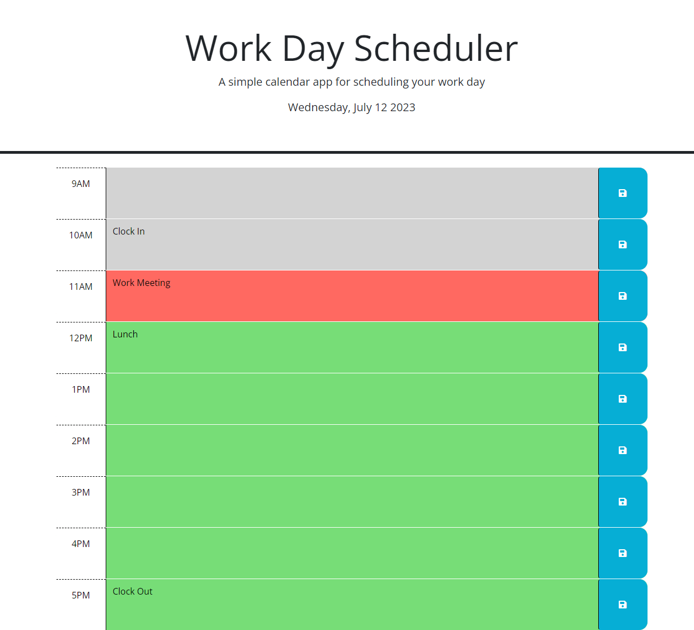

# <Work-Day-Planner Website>

## Description
This website was created help establish a simple way of having an online planner for the current day. It begins at 9AM and stops at 5PM. When you add in an even to the site it will save it onto your local storage so that you can close it and reopen it later on during the day. When the hour has passed it will turn grey. During the current hour it will remain red. Any future hour will be turned green.

## Usage

Enter information within each time table in order to begin using the day planner.

# Link
https://stygiantanuki.github.io/Work-Day-Scheduler/